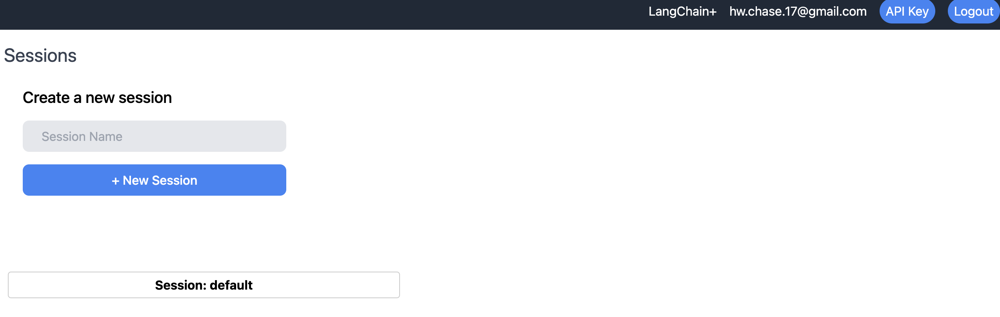
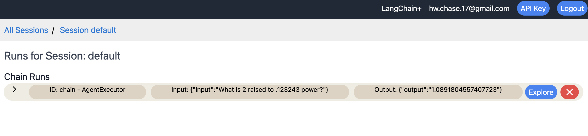

# 追踪

通过在LangChain运行中启用追踪，您将能够更有效地可视化、逐步调试您的链与代理。

首先，您需要安装追踪并正确设置您的环境。
您可以使用本地主机的版本（使用Docker）或云端主机的版本（目前为封闭alpha测试版本）。
如果您有兴趣使用托管平台，请在[此处](https://forms.gle/tRCEMSeopZf6TE3b6)填写表格。

- [本地主机设置](../tracing/local_installation.md)
- [云端主机设置](../tracing/hosted_installation.md)

## 跟踪演练

当您首次访问UI时，您应该会看到一个包含您跟踪会话的页面。
一个名为“default”的初始会话已经为您创建。
会话只是将跟踪分组在一起的一种方式。
如果您单击一个会话，它会带您到一个没有记录的跟踪记录的页面，显示“无运行”。
您可以使用新会话表单创建新会话。


如果我们点击“默认”会话，可以看到我们还没有存储任何痕迹。


如果我们现在启用跟踪功能运行链和代理，我们将看到数据出现在此处。例如，我们可以运行 [this notebook](../tracing/agent_with_tracing.ipynb) 。运行后，我们将看到一个初始跟踪出现。



从这里我们可以通过点击箭头来显示嵌套运行，以高层次地探索跟踪。我们可以不断地点击，进一步探索更深的内容。


我们还可以点击顶层运行的“探索”按钮，以进一步深入研究。在这里，我们可以完整地看到输入和输出，以及所有嵌套的跟踪。


我们可以继续深入探索每个这些嵌套的跟踪。例如，这里是最低级的跟踪，包括针对LLM的精确输入和输出。


## 更改会话
1. 要将跟踪记录到除了“default”之外的其他会话，您可以将 `LANGCHAIN_SESSION` 环境变量设置为要记录到的会话名称：
```python
import os
os.environ["LANGCHAIN_TRACING"] = "true"
os.environ["LANGCHAIN_SESSION"] = "my_session" # Make sure this session actually exists. You can create a new session in the UI.
```
2. 如果要在脚本或笔记本的中途切换会话，请勿设置 `LANGCHAIN_SESSION` 环境变量。而是使用 `langchain.set_tracing_callback_manager(session_name="my_session")` 方法。