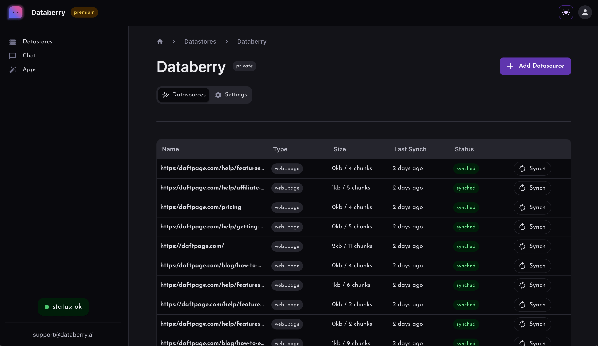

# Databerry

此页面介绍了如何在LangChain中使用[Databerry](https://databerry.ai)。

## Databerry是什么？

Databerry是一个[开源](https://github.com/gmpetrov/databerry)的文档检索平台，可帮助将个人数据与大型语言模型连接起来。



## 快速开始

从LangChain检索存储在Databerry中的文档非常容易！
```python
from langchain.retrievers import DataberryRetriever

retriever = DataberryRetriever(
    datastore_url="https://api.databerry.ai/query/clg1xg2h80000l708dymr0fxc",
    # api_key="DATABERRY_API_KEY", # optional if datastore is public
    # top_k=10 # optional
)

docs = retriever.get_relevant_documents("What's Databerry?")
```
