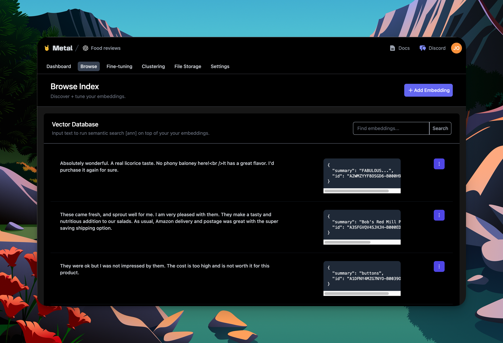

# Metal

本页面介绍如何在LangChain中使用[GetMetal](https://getmetal.io)。

## 什么是GetMetal？

GetMetal是一个用于生产的管理检索和内存平台。将数据轻松地索引到Metal中，并在它上面运行语义搜索和检索。



## 快速开始

首先，[创建一个GetMetal账户](https://app.getmetal.io/signup)。

然后，您可以轻松地利用`MetalRetriever`类开始检索数据进行语义搜索、提示上下文等。该类接受一个` Metal `实例和传递给GetMetal API的参数字典。
```python
from langchain.retrievers import MetalRetriever
from metal_sdk.metal import Metal


metal = Metal("API_KEY", "CLIENT_ID", "INDEX_ID");
retriever = MetalRetriever(metal, params={"limit": 2})

docs = retriever.get_relevant_documents("search term")
```
